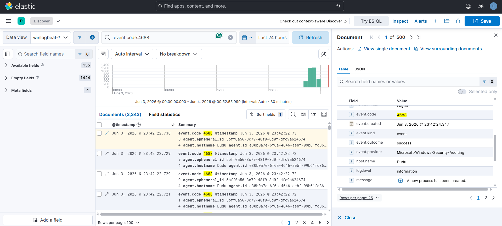
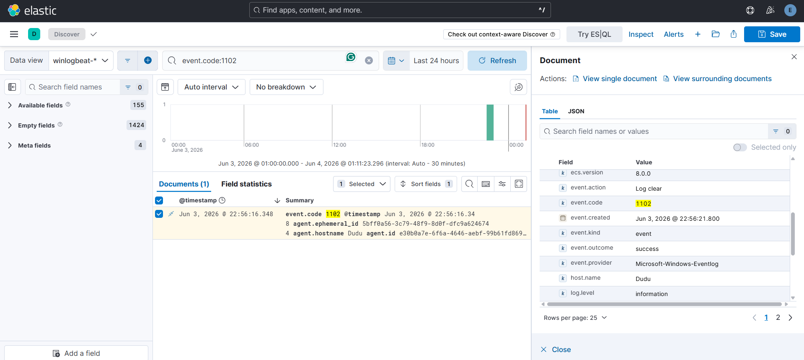
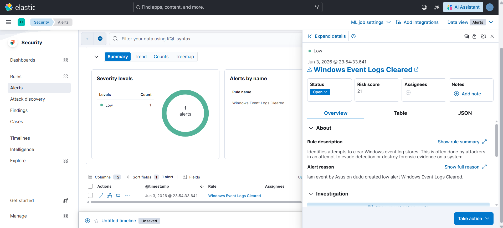

# 🛡️ Elastic SIEM Home Lab

A fully functional Security Information and Event Management (SIEM) lab built using the Elastic Stack and deployed with Docker on Windows. This project simulates a real Security Operations Center (SOC) environment for log collection, threat detection, alert generation, and security monitoring.

---

## 📌 Project Overview

This home lab demonstrates the complete SIEM workflow, from collecting Windows security logs to generating security alerts using Elastic Security detection rules.

**Built by:** Young Li Vui  
**Date:** June 2026  
**Project Type:** Cybersecurity Home Lab  
**Focus Areas:** SIEM, Threat Detection, Log Analysis, Security Monitoring

---

## 🏗️ Architecture

```text
Windows Host
│
├── Docker
│   ├── Elasticsearch
│   │     └── Log Storage & Search Engine
│   │
│   └── Kibana
│         └── SIEM Dashboard & Alerting
│
├── Winlogbeat
│     └── Collects Windows Event Logs
│
└── Windows Audit Policy
      ├── Event ID 4624 (Successful Logon)
      ├── Event ID 4625 (Failed Logon)
      ├── Event ID 4688 (Process Creation)
      └── Event ID 1102 (Audit Log Cleared)
```

---

## 🧰 Tools & Technologies

| Tool | Purpose |
|--------|--------|
| Elasticsearch 8.18 | Log storage and indexing |
| Kibana 8.18 | Visualization and SIEM platform |
| Elastic Security | Detection rules and alerting |
| Winlogbeat | Windows Event Log collection |
| Docker Desktop | Container deployment |
| Windows Audit Policy | Security event generation |
| KQL | Log investigation and threat hunting |

---

## ⚙️ Lab Setup

### Prerequisites

- Windows 10/11
- Docker Desktop
- PowerShell (Administrator)
- Minimum 8GB RAM

### 1. Deploy Elasticsearch & Kibana

```yaml
services:
  elasticsearch:
    image: docker.elastic.co/elasticsearch/elasticsearch:8.18.0

  kibana:
    image: docker.elastic.co/kibana/kibana:8.18.0
```

```powershell
docker compose up -d
```

---

### 2. Configure Winlogbeat

Configured Winlogbeat to collect:

- Security Logs
- System Logs
- PowerShell Logs

```yaml
winlogbeat.event_logs:
  - name: Security
  - name: System
  - name: Microsoft-Windows-PowerShell/Operational
```

---

### 3. Enable Process Creation Auditing

```powershell
auditpol /set /subcategory:"Process Creation" /success:enable
```

Verification:

```powershell
auditpol /get /subcategory:"Process Creation"
```

---

### 4. Install Elastic Security Detection Rules

Installed and enabled Elastic Security prebuilt detection rules for Windows security monitoring and threat detection.

Examples:

- Windows Event Logs Cleared
- Encoded PowerShell Command
- PowerShell Script with Log Clear Capabilities
- Suspicious Execution via Windows Subsystem for Linux
- Privilege Escalation via Named Pipe Impersonation

---

## 🔍 Security Events Collected

| Event ID | Description | Status |
|-----------|------------|---------|
| 4624 | Successful Logon | ✅ |
| 4625 | Failed Logon | ✅ |
| 4672 | Special Privileges Assigned | ✅ |
| 4688 | Process Creation | ✅ |
| 4798 | User Group Enumeration | ✅ |
| 5379 | Credential Manager Read | ✅ |
| 1102 | Audit Log Cleared | ✅ |

---

## 🚨 Detection Rules & Alerts

### Windows Event Logs Cleared

**Rule:** Windows Event Logs Cleared

**Severity:** Low

**Risk Score:** 21

**Event ID:** 1102

**MITRE ATT&CK:**
T1070.001 – Clear Windows Event Logs

This alert was successfully triggered after clearing the Windows Security Log using:

```powershell
wevtutil cl Security
```

This technique is commonly used by attackers attempting to remove forensic evidence from compromised systems.

---

## 🎯 Attack Simulations Performed

| Technique | Command | MITRE ATT&CK |
|------------|---------|-------------|
| Log Clearing | `wevtutil cl Security` | T1070.001 |
| Encoded PowerShell | `powershell -enc SQBFAFgA` | T1059.001 |
| Execution Policy Bypass | `powershell -ExecutionPolicy Bypass` | T1059.001 |
| System Enumeration | `whoami`, `ipconfig`, `net user`, `systeminfo` | T1082 |

---

## 📊 SIEM Capabilities Demonstrated

- ✅ Windows Event Log Collection
- ✅ Log Ingestion with Winlogbeat
- ✅ Elasticsearch Indexing
- ✅ Security Monitoring
- ✅ Detection Rule Management
- ✅ Threat Detection
- ✅ Security Alert Generation
- ✅ Alert Investigation
- ✅ Log Analysis
- ✅ Threat Hunting using KQL
- ✅ Windows Security Event Monitoring

---

## 📷 Screenshots

### Process Creation Event Monitoring (Event ID 4688)

Windows Security Event ID 4688 was successfully collected by Winlogbeat and ingested into Elasticsearch. This event records newly created processes and is commonly used for threat hunting, process monitoring, and suspicious activity detection.



---

### Windows Event Log Cleared Event (Event ID 1102)

Windows Security Event ID 1102 was generated when the Windows Event Log was cleared. This event is important because attackers often attempt to clear logs to remove evidence of malicious activity. Winlogbeat successfully collected and forwarded the event to Elasticsearch for analysis.



---

### Security Alert Generated by Elastic Security

Elastic Security successfully detected Event ID 1102 using a prebuilt detection rule and automatically generated a security alert. This demonstrates the full detection workflow from Windows event generation to SIEM alerting.



---

## 🔄 Security Monitoring Workflow

```text
Windows Host
    ↓
Windows Event Logs
    ↓
Winlogbeat
    ↓
Elasticsearch
    ↓
Kibana
    ↓
Elastic Security Rules
    ↓
Security Alerts
```

---

## 🧠 Key Learnings

- Deploying Elastic Stack using Docker
- Configuring Winlogbeat for Windows log collection
- Understanding SIEM architecture and workflows
- Windows Security Event analysis
- Detection rule management
- Alert investigation and triage
- Threat hunting with Kibana Query Language (KQL)
- MITRE ATT&CK mapping
- SOC monitoring fundamentals

---

## 💼 Skills Demonstrated

- SIEM Administration
- Elasticsearch
- Kibana
- Elastic Security
- Winlogbeat
- Docker
- Windows Event Logging
- Threat Detection
- Alert Investigation
- Log Analysis
- Threat Hunting
- Security Monitoring
- Incident Detection

---

## 📚 References

- https://www.elastic.co/guide/en/security/current/index.html
- https://www.elastic.co/guide/en/fleet/current/index.html
- https://attack.mitre.org/
- https://www.ultimatewindowssecurity.com/securitylog/encyclopedia/

---

## 🚀 Future Improvements

- Deploy Elastic Agent and Elastic Defend
- Build custom detection rules
- Integrate Sysmon logging
- Create custom SOC dashboards
- Simulate additional ATT&CK techniques
- Perform incident response investigations
