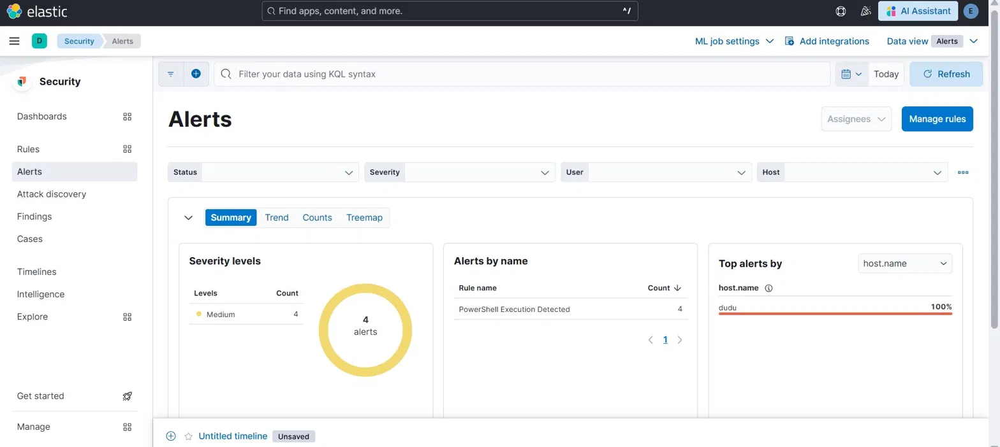
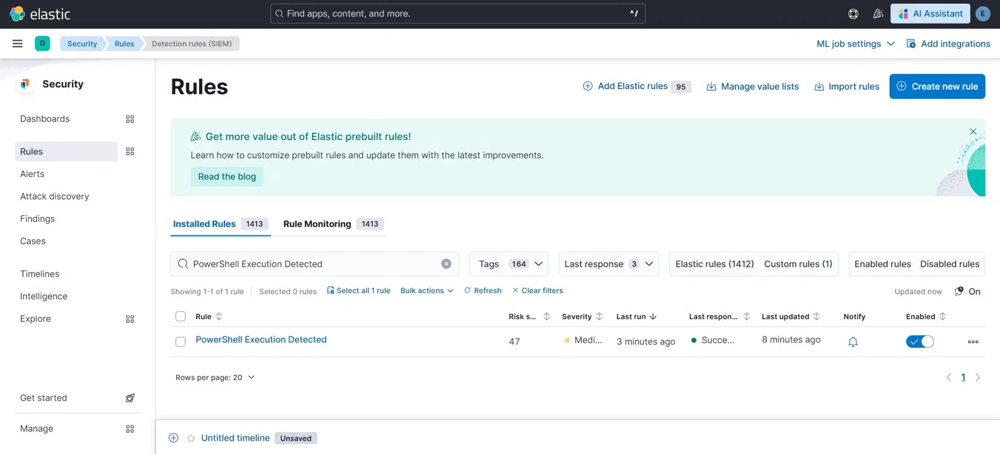
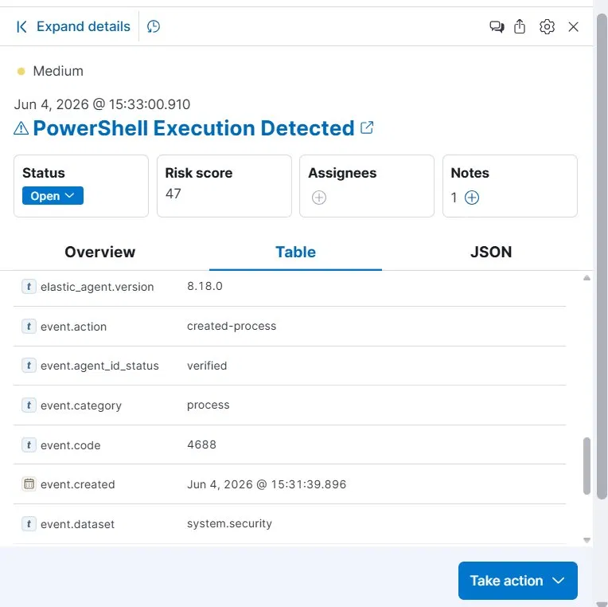
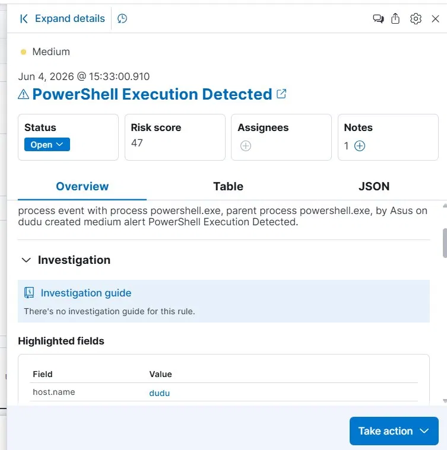

# 🛡️ Elastic SIEM Home Lab

A fully functional Security Information and Event Management (SIEM) lab built using the Elastic Stack and deployed with Docker on Windows. This project simulates a real Security Operations Center (SOC) environment — covering log collection, custom detection rule engineering, real alert generation, and SOC-style alert investigation and triage.

---

## 📌 Project Overview

**Built by:** Young Li Vui  
**Date:** June 2026  
**Project Type:** Cybersecurity Home Lab  
**Focus Areas:** SIEM, Detection Engineering, Threat Detection, Incident Response, Log Analysis

---

## 🏗️ Architecture

```text
Windows Host
│
├── Docker
│   ├── Elasticsearch 8.18
│   │     └── Log Storage & Search Engine
│   │
│   ├── Kibana 8.18
│   │     └── SIEM Dashboard, Detection Rules & Alerting
│   │
│   └── Setup Container
│         └── Auto-initializes kibana_system password on startup
│
├── Winlogbeat
│     └── Collects Windows Security Event Logs → Elasticsearch
│
└── Windows Audit Policy
      ├── Event ID 4624 (Successful Logon)
      ├── Event ID 4625 (Failed Logon)
      ├── Event ID 4688 (Process Creation)
      └── Event ID 1102 (Audit Log Cleared)
```

---

## 🧰 Tools & Technologies

| Tool | Purpose |
|------|---------|
| Elasticsearch 8.18 | Log storage, indexing, and search |
| Kibana 8.18 | SIEM platform and visualization |
| Elastic Security | Detection rules, alerting, and investigation |
| Winlogbeat | Windows Event Log collection and shipping |
| Docker Desktop | Container deployment on Windows |
| Windows Audit Policy | Security event generation |
| KQL | Detection queries and threat hunting |

---

## ⚙️ Lab Setup

### Prerequisites

- Windows 10/11
- Docker Desktop
- PowerShell (Administrator)
- Minimum 8GB RAM

### 1. Deploy Elasticsearch & Kibana with Security Enabled

```yaml
services:
  elasticsearch:
    image: docker.elastic.co/elasticsearch/elasticsearch:8.18.0
    container_name: elasticsearch
    environment:
      - discovery.type=single-node
      - xpack.security.enabled=true
      - ELASTIC_PASSWORD=changeme
      - ES_JAVA_OPTS=-Xms1g -Xmx1g
    ports:
      - "9200:9200"

  kibana:
    image: docker.elastic.co/kibana/kibana:8.18.0
    container_name: kibana
    environment:
      - ELASTICSEARCH_HOSTS=http://elasticsearch:9200
      - ELASTICSEARCH_USERNAME=kibana_system
      - ELASTICSEARCH_PASSWORD=KibanaPass123!
      - XPACK_ENCRYPTEDSAVEDOBJECTS_ENCRYPTIONKEY=abcdefghijklmnopqrstuvwxyz123456
      - XPACK_SECURITY_ENCRYPTIONKEY=abcdefghijklmnopqrstuvwxyz123456
      - XPACK_REPORTING_ENCRYPTIONKEY=abcdefghijklmnopqrstuvwxyz123456
    ports:
      - "5601:5601"
    depends_on:
      - elasticsearch

  setup:
    image: docker.elastic.co/elasticsearch/elasticsearch:8.18.0
    container_name: setup
    depends_on:
      - elasticsearch
    volumes:
      - ./setup.sh:/setup.sh
    entrypoint: ["bash", "/setup.sh"]
    restart: "no"
```

```powershell
docker compose up -d
```

> **Note:** The `setup` service automatically sets the `kibana_system` password via the Elasticsearch Security API on every startup, preventing the password desync issue common in Docker-based Elastic deployments.

---

### 2. Configure Winlogbeat

Configured Winlogbeat to collect Windows Security, System, and PowerShell logs:

```yaml
winlogbeat.event_logs:
  - name: Security
  - name: System
  - name: Microsoft-Windows-PowerShell/Operational
```

---

### 3. Enable Process Creation Auditing

```powershell
auditpol /set /subcategory:"Process Creation" /success:enable
```

---

## 🔍 Security Events Collected

| Event ID | Description | Collected |
|----------|-------------|-----------|
| 4624 | Successful Logon | ✅ |
| 4625 | Failed Logon | ✅ |
| 4672 | Special Privileges Assigned | ✅ |
| 4688 | Process Creation | ✅ |
| 4798 | User Group Enumeration | ✅ |
| 5379 | Credential Manager Read | ✅ |
| 1102 | Audit Log Cleared | ✅ |

---

## 🚨 Detection Rules & Alerts

### Rule 1 — Windows Event Logs Cleared (Prebuilt Rule)

| Field | Value |
|-------|-------|
| **Severity** | Low |
| **Risk Score** | 21 |
| **Event ID** | 1102 |
| **MITRE ATT&CK** | T1070.001 — Indicator Removal: Clear Windows Event Logs |

Triggered by simulating an attacker clearing forensic evidence:

```powershell
wevtutil cl Security
```

**Kibana Discover — Event ID 1102 ingested from Winlogbeat:**


**Elastic Security Alert — Windows Event Logs Cleared fired:**


> Alert detail shows: event by user `Asus` on host `dudu`, Risk score 21, Status Open, rule description confirming this technique is used by attackers to destroy forensic evidence.

---

### Rule 2 — PowerShell Execution Detected (Custom Rule)

| Field | Value |
|-------|-------|
| **Rule Type** | Custom KQL Query |
| **Query** | `event.code:4688 AND process.name:("powershell.exe" OR "pwsh.exe")` |
| **Severity** | Medium |
| **Risk Score** | 47 |
| **Schedule** | Every 5 minutes |
| **MITRE ATT&CK** | T1059.001 — Command and Scripting Interpreter: PowerShell |

This rule was built from scratch using Kibana's Detection Rules editor and successfully generated **4 real alerts** during lab testing.

**Kibana Discover — 3,343 Event ID 4688 (Process Creation) documents ingested:**


> Shows `event.code: 4688`, `event.provider: Microsoft-Windows-Security-Auditing`, `message: A new process has been created`, host `Dudu` — confirming Winlogbeat is successfully shipping process creation events to Elasticsearch.

**Elastic Security — 4 Medium Alerts fired by custom PowerShell rule:**



**Custom Detection Rule — Enabled and running:**



---

## 🔎 Alert Investigation (SOC Workflow)

After alerts fired, a full SOC-style investigation was performed in Kibana Security.

**Alert detail showing forensic evidence:**



**Forensic fields extracted:**

| Field | Value |
|-------|-------|
| `event.code` | 4688 |
| `event.action` | created-process |
| `process.name` | powershell.exe |
| `process.parent.name` | powershell.exe |
| `event.dataset` | system.security |
| `user.name` | Asus |
| `host.name` | dudu |
| `event.created` | Jun 4, 2026 @ 15:31:39 |

**Alert reason (Kibana):**
> *"process event with process powershell.exe, parent process powershell.exe, by Asus on dudu created medium alert PowerShell Execution Detected."*

**Investigation steps performed:**
1. Opened alert in Kibana Security → Alerts
2. Reviewed Overview, Table, and JSON tabs for forensic data
3. Identified process name, parent process, user, and host
4. Added investigation note documenting findings
5. Classified as **False Positive** (authorized lab activity)
6. Closed alert — mirroring real SOC triage procedure



---

## 🎯 Attack Simulations Performed

| Technique | Command | MITRE ATT&CK |
|-----------|---------|--------------|
| Log Clearing | `wevtutil cl Security` | T1070.001 |
| Encoded PowerShell | `powershell -enc SQBFAFgA` | T1059.001 |
| Execution Policy Bypass | `powershell -ExecutionPolicy Bypass` | T1059.001 |
| System Enumeration | `whoami`, `Get-Process`, `Get-LocalUser` | T1082 |

---

## 📊 SIEM Capabilities Demonstrated

- ✅ Elastic Stack deployment with X-Pack Security enabled
- ✅ Role-based authentication (elastic superuser + kibana_system service account)
- ✅ Windows Event Log collection via Winlogbeat
- ✅ Elasticsearch log ingestion and indexing
- ✅ 1,400+ prebuilt Elastic detection rules loaded
- ✅ Custom KQL detection rule built from scratch
- ✅ MITRE ATT&CK technique mapping
- ✅ Real alert generation from live Windows events
- ✅ SOC-style alert triage and investigation
- ✅ Incident documentation and alert closure

---

## 🔄 Security Monitoring Workflow

```text
Windows Host
    ↓
Windows Event Logs (Event ID 4688, 4624, 4625, 1102)
    ↓
Winlogbeat
    ↓
Elasticsearch (indexed, searchable)
    ↓
Kibana Elastic Security
    ↓
Detection Rules (Prebuilt + Custom KQL)
    ↓
Security Alerts → Investigation → Triage → Close
```

---

## 🧠 Key Learnings

- Deploying production-grade Elastic Stack with full security mode in Docker
- Debugging Elasticsearch/Kibana authentication (kibana_system, X-Pack Security)
- Configuring Winlogbeat for Windows Security Event Log collection
- Writing custom KQL detection rules and mapping to MITRE ATT&CK
- Performing end-to-end SOC analyst alert triage workflow
- Writing incident response documentation

---

## 📁 Repository Contents

| File | Description |
|------|-------------|
| `docker-compose.yml` | Elastic Stack deployment config |
| `setup.sh` | Auto-initializes kibana_system password |
| `Incident-Response-Report.md` | Full IR report for PowerShell alert |
| `screenshots/` | New lab evidence screenshots |
| `*.png` | Original lab evidence screenshots |

---

## 💼 Skills Demonstrated

`Elastic Stack` `SIEM` `Detection Engineering` `KQL` `Winlogbeat` `Windows Event Logs` `Docker` `X-Pack Security` `Incident Response` `Alert Triage` `MITRE ATT&CK` `Log Analysis` `Threat Detection` `SOC Workflow`

---

## 🚀 Future Improvements

- Integrate Sysmon for richer process and network telemetry
- Deploy Elastic Agent with Elastic Defend for EDR capabilities
- Build custom SOC dashboards in Kibana
- Simulate additional ATT&CK techniques (lateral movement, persistence)
- Set up Active Directory home lab for identity-based detections

---

## 📚 References

- https://www.elastic.co/guide/en/security/current/index.html
- https://attack.mitre.org/
- https://www.ultimatewindowssecurity.com/securitylog/encyclopedia/
